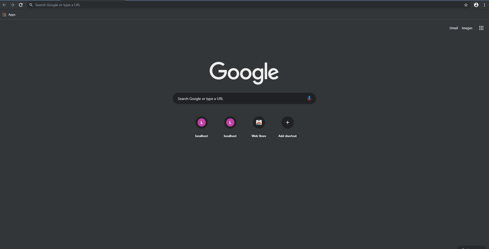
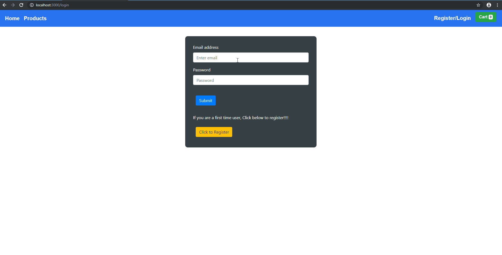
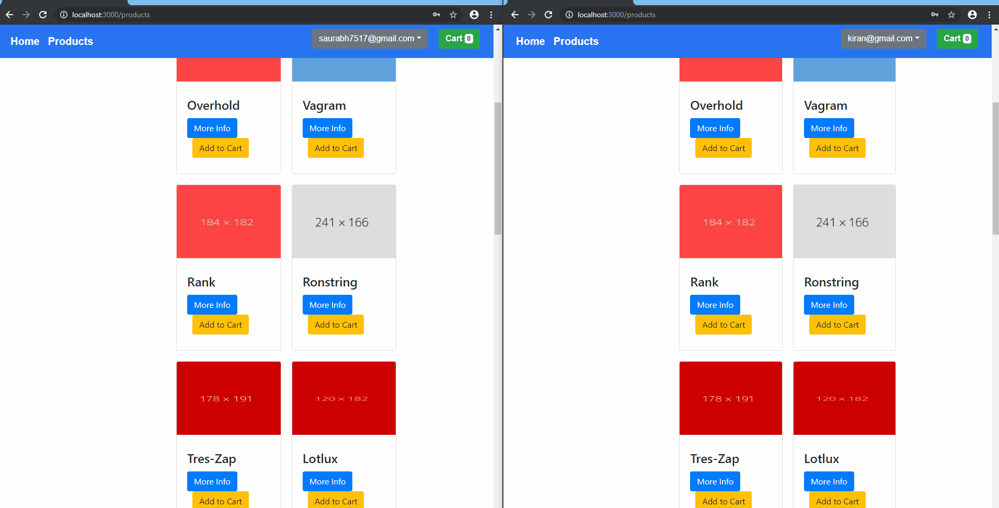

# swiftkart app
This is an e-commerce application. Front end is developed in React and back-end is developed in java(spring framework). The project is undertaken for hands on experience with React api’s. React's Context API is used to manage state for complete front end application

## Tech Stack
- FrontEnd
  - React
  - ES6
  - react-router
  - bootstrap
  - react-bootstrap
  
- Backend
  - Java 8
  - Spring Framework
  - WebSockets(for updating count values for logged in users)
  - Mysql
  - JDBC 
  - javawebtokens for authorization and authentication 
## Demo
### When user is not logged in
- Home Page consists of a jumbotron and a slider.
- Products page can be only viewed once the user logs in.
- Register/Login is used for the existing users to login and create new users.
- Cart status can only be changed once a user logs in and if they have items in their cart or they add items in the cart.

### When user logs in
- New User has to register by providing his details.
- Once registered, user can login and view products and add products to his cart. Returning users can view products in their cart and add more.
- Once a product is clicked a modal is opened which notifies that the product is added to the cart, now the user has the option to view    cart products or continue shopping added to the cart, the status on the UI component is changed to “incart”.

### Realtime updates of quantity left for product added in cart for all logged in users
- Two different users can view the quantity update for a particular product added to in cart. Similarly on removing the product its count is updated for every product for logged in users.

